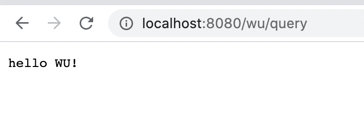

# **手写简易spring框架**

运行效果：



项目分为2个大板块：IOC和handlerMapping，分别实现控制反转和把url和类或方法关联起来。项目会用到servlet，因为涉及到web，如果只关注最核心的springIoc的地方，是可以不用servlet这个包的。


## IOC

### 容器：

```java
//保存application.properties里面所有的配置，主要是scan-package=com.myDemo（我需要扫描的包）
private Properties properties=new Properties();
//上面properties中的所有类（没有被@MyController、@MyService注释的类也在其中）
private List<String> beanNameList=new ArrayList<String>();
//key:保存所有@MyController、@MyService的类的类名;value:保存所有类的实例
private Map<String,Object> iocMap=new HashMap<String, Object>();
```

### 初始化：

```java
//1,application.properties里面所有的配置
doLoadConfig("application.properties");
//2,扫描上述配置下的所有类，并且全部加入beanNameList
doScanner(properties.getProperty("scan-package"));
//3,将上述beanNameList中的被@MyController,@MyService注释类全部加入iocMap
doInstance();
//4,如果某属性被@MyAutowired注释，在iocMap中找到这个类，然后给它赋值
doAutowired();

```


## handlerMapping

```java
//1,存路径到方法的映射，例如：/index映射到com.myDemo.controller.hello()这个方法上
Map<String, Method> handlerMapping = new HashMap<String, Method>();
//2,通过反射机制执行这个方法
protected void doPost(HttpServletRequest req, HttpServletResponse resp) throws ServletException, IOException {
        ……
            method.invoke(iocMap.get(method.getDeclaringClass().getName()),req,resp);
        ……
    }
```


## 重要地方说明

1、本着理解原理的目的，ioc部分按照单例模式实现，多例模式未实现。

2、iocMap中的key是全类名，例如：com.myDemo.controller.Controller

3、递归查找包下所有类：doScanner(properties.getProperty("scan-package"));

4、

```java
private void doInstance() {
    for (String beanName:beanNameList){
        Class<?> aClass = Class.forName(beanName);
        if (aClass.isAnnotationPresent(MyController.class)){
            //如果MyController，把类放入iocMap
            iocMap.put(beanName,o);
        }else if(aClass.isAnnotationPresent(MyService.class)){
          //如果MyService，把类放入iocMap，然后把这个类的所有父接口也放入iocMap，他们的key不同，但是他们的value都是同一个实例，因为我们在Controller类中使用声明Service时，其实声明的是private IService iService而不是private ServiceImpl serviceImpl;
            Object o = aClass.newInstance();
            iocMap.put(beanName,o);
            for (Class i:aClass.getInterfaces()){
                if(!iocMap.containsKey(i.getName())){
                    iocMap.put(i.getName(),o);
                }
            }
        }
    }
    log.info("iocMap:"+iocMap.toString());
}
```

5、doAutowired时，比如：

```java
public class Controller {
    @MyAutowired
    private IService iService;
		…………
}
```

我们通过IService可以知道这个类的全类名为com.myDemo.service.IService，通过这个全类名查找IocMap，获取Object，再通过反射注入。

6、demo中iocMap里面保存的是：

```json
{com.myDemo.service.impl.ServiceImpl=com.myDemo.service.impl.ServiceImpl@f5507eb, com.myDemo.service.IService=com.myDemo.service.impl.ServiceImpl@f5507eb, com.myDemo.controller.Controller=com.myDemo.controller.Controller@53e4c68f}
```

7、handlerMapping中保存的是：

```
/wu/query = public void com.myDemo.controller.Controller.querySql
```

